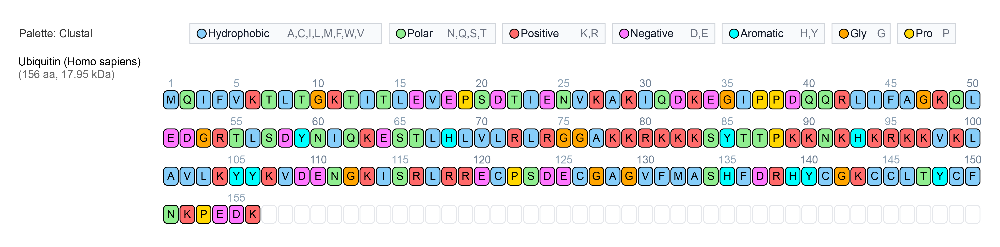

# Amino-acid Sequence Visualizer

**Amino-acid Sequence Visualizer** is an interactive web-based tool designed for rapid exploration, annotation, and export of protein sequences for bioinformatics workflows.

Paste or upload FASTA-formatted sequences to render each entry as an individual or aligned layout, interactive grid, enabling intuitive inspection of residue-level details and patterns.

Choose from a range of available color schemes including **Clustal**, **Zappo**, **Taylor**, **Rasmol**, and a color-blind-friendly palette to visualize amino acid properties such as hydrophobicity, charge, and chemical class, with an adaptive legend that updates in real time. Instantly search for and highlight sequence motifs (supports `X`/`*` for variable residues), or select any region to analyze length and hydrophobic content.

The interface supports fast residue mutagenesis via **double-click**, with **undo/redo** options for rapid residue swapping. All sequence tracks remain interactive: simply **drag-and-drop** to reorder, or **lock** tracks to prevent accidental edits. When ready, export high-resolution **SVG** or **PNG** images that fully preserve your chosen color mapping, sequence highlights, mutations, and custom legends that are ready for publication or presentation.

Live URL: https://mbuyukyoruk.github.io/aaVisualizer/

---

## Example Output

---

## Usage
1. Visit https://mbuyukyoruk.github.io/aaVisualizer/
2. **Choose input mode:**  
   - Select **Manual** to type or paste a single sequence (optionally enter a name).
   - Select **Upload file (FASTA)** to import one or more protein sequences in FASTA format.

3. **Add sequences:**  
   - In **Manual** mode, enter a name and a protein sequence (amino-acid letters and `-` for gaps), then click **Add**.
   - In **FASTA** mode, upload your `.fa`, `.fasta`, or `.faa` file and click **Import**.

4. **Visualize and interact:**  
   - Sequences appear as interactive grids.  
   - Change color palette using the dropdown menu.
   - Search for motifs using the Motif bar (`X` or `*` as wildcards).
   - Select regions to view info; double-click residues to mutate.
   - Drag-and-drop to reorder; use lock to freeze sequence.

5. **Export:**  
   - Click **Export SVG** or **Export PNG** to download your visualization.

---

## Notes

- Works entirely in your browser—no data is uploaded or stored.
- Designed for protein sequences only.
- Requires a modern browser (Chrome, Firefox, Safari, Edge).
- Open `aavisualizer.html` directly in your browser to begin.

---